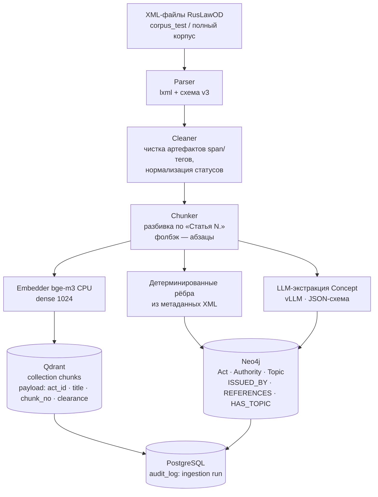
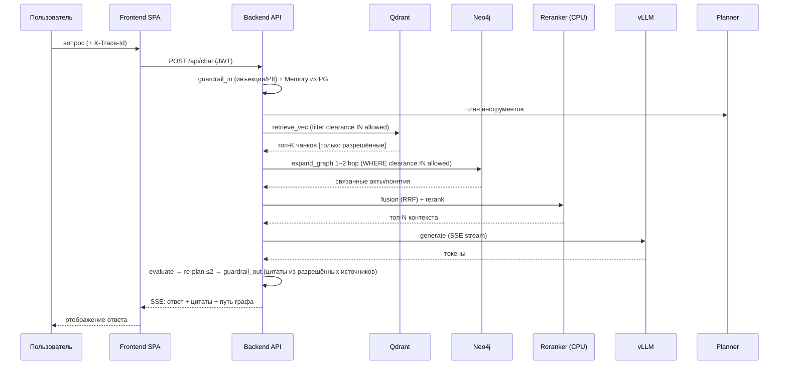
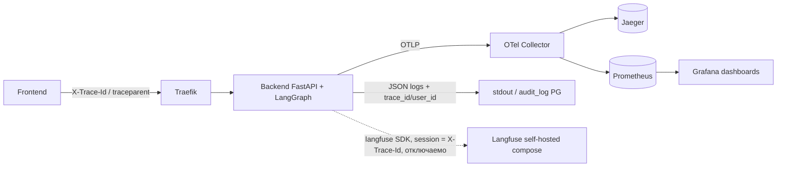

# Data Flow — потоки данных платформы

Два основных потока: **ingestion** (загрузка корпуса) и **query** (вопросно-ответный поиск).
Все шаги трассируются через OTel (`X-Trace-Id`), секретные данные не покидают хранилища
без прохождения ACL-фильтра (ADR-007).

## 1. Поток Ingestion

Шаги:

1. **Parser** читает XML RusLawOD v3; извлекает метаданные: `doc_author_normal_formIPS`
   (издатель), классификатор (`код$Название$...` в `<reference>`), keywords (CSV),
   ссылки `<ref nd="ID">`, статус.
2. **Chunker** режет текст по заголовкам «Статья N.»; если статья слишком крупная или
   заголовков нет — фолбэк на абзацы (~512–1024 токена).
3. **Embedder** считает dense-вектора батчами (CPU).
4. **Qdrant upsert** — идемпотентный: повторный прогон обновляет точки по детерминированным ID.
5. **Граф**: детерминированные рёбра строятся без LLM (`REFERENCES` — только если цель есть в корпусе);
   `(:Concept)` извлекается LLM JSON-списком и пост-валидацией.
6. Каждый запуск пишется в `audit_log`; часть актов размечается INTERNAL/SECRET для демо RBAC.

## 2. Поток Query

Ключевые свойства потока:

- **Pre-fetch ACL**: фильтр clearance применяется внутри запросов к Qdrant/Neo4j —
  запрещённые данные физически не попадают в контекст генерации.
- **Agent Loop**: после generate узел evaluate решает: достаточно ли контекста;
  при нехватке — возврат к planner с уточнением (максимум 2 итерации).
- **Цитаты**: формируются только из отфильтрованного контекста; guardrail_out проверяет
  соответствие цитат источникам.
- **Fallback**: деградация компонентов отражается статусами `degraded` / `empty`,
  а не ошибками пользователю.

## 3. Поток наблюдаемости

Правило разбора инцидента: `X-Trace-Id` из ответа API → спаны в Jaeger → логи с этим trace_id.
